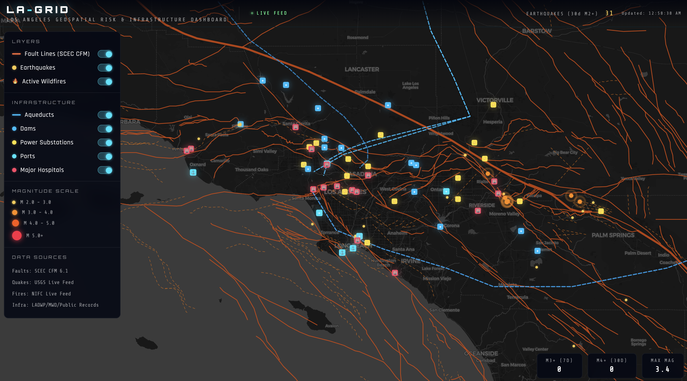

# LA-GRID
### Los Angeles Geospatial Risk & Infrastructure Dashboard

An interactive, browser-based geospatial risk dashboard for the greater Los Angeles region (from Santa Barbara to Oceanside). Displays active fault lines, live earthquake data, active wildfire incidents and critical infrastructure on a dark cinematic map.

  License:      Data sources are publicly available under their respective
                open data licenses. See individual source URLs below.
                ©Liliane ML Burkhard, 2025

---

## Preview

---

## Features

- **455 fault traces** from the SCEC Community Fault Model (CFM) v6.1, including surface traces (solid) and blind fault projections (dashed) — Hover over any fault line to see its name.
- **Live earthquake feed** — M2.0+ earthquakes for the last 30 days via the USGS real-time API, color-coded and sized by magnitude. Earthquakes M3.0+ pulse with an animated ring to indicate larger earthquake activity.
- **Live wildfire feed** — active California wildfire incidents from the NIFC live data service, shown as animated flame icons 🔥
- **Critical infrastructure layers:**
  - **Aqueducts** — Los Angeles Aqueduct (1st & 2nd), Colorado River Aqueduct, State Water Project/California Aqueduct
  - **Dams** — 15 major dams and reservoirs including Castaic, Pyramid, Hansen, San Gabriel, Diamond Valley Lake and Prado
  - **Power Substations** — 18 major LADWP & SCE substations and generating stations
  - **Ports & Airports** — Port of LA, Port of Long Beach, Port of Hueneme, LAX, Burbank, Long Beach and Ontario airports
  - **Major Hospitals** — 16 major trauma centers and medical facilities across the region
- **Interactive popups** — click any earthquake, wildfire, or infrastructure element for details; hover over any fault line to see its name
- **Layer toggles** — independently show/hide all layers
- **Auto-refresh** — earthquake data refreshes every 5 minutes; wildfires update every few hours
- **Zero dependencies** — single self-contained HTML file, no server or build step required

---

## Usage

Open it in any browser. No installation, no server, no API key needed.

The file is fully self-contained: The SCEC CFM fault geometry is embedded directly in the HTML. The earthquake and wildfire data are fetched live from public APIs each time the page loads. Infrastructure data is hardcoded from public records.

---

## Data Sources

| Layer | Source | URL |
|---|---|---|
| Fault Lines | SCEC Community Fault Model v6.1 | https://www.scec.org/research/cfm |
| Earthquakes | USGS Earthquake Hazards Program | https://earthquake.usgs.gov/fdsnws/event/1/ |
| Wildfires | NIFC WFIGS Incident Locations | https://data-nifc.opendata.arcgis.com/ |
| Aqueducts | LADWP/Metropolitan Water District | https://www.ladwp.com / https://www.mwdh2o.com |
| Dams | National Inventory of Dams/Public Records | https://nid.usace.army.mil |
| Power Substations | LADWP/SCE/Public Records | https://www.ladwp.com / https://www.sce.com |
| Ports & Airports | Port of LA/Port of Long Beach/FAA | Public records |
| Hospitals | California OSHPD/Public Records | https://data.chhs.ca.gov |
| Basemap | CartoDB Dark Matter | https://carto.com/basemaps/ |

### Fault Line Data

Fault traces are from the **SCEC CFM 6.1 Preferred Model** — 443 fault objects representing active faults in southern California. The CFM provides the most detailed 3D representation of southern California faults, built from mapped surface traces, seismicity, seismic reflection profiles and geologic cross-sections. Both surface traces (solid lines) and blind fault projections (dashed lines) are included.

Reference: Plesch et al. (2007), *Community Fault Model (CFM) for Southern California*, Bulletin of the Seismological Society of America, 97(6):1793–1802.

### Earthquake Data

Live feed from the USGS Earthquake Hazards Program covering M2.0+ events within the region (33.2–34.9°N, 120.6–116.4°W) for the past 30 days. Color and size indicate magnitude:

| Color | Magnitude |
|---|---|
| Yellow | M 2.0 – 3.0 |
| Orange | M 3.0 – 4.0 |
| Dark orange | M 4.0 – 5.0 |
| Red | M 5.0+ |

Earthquakes M3.0+ that occurred within the past 30 days display a pulsing ring to indicate activity. The feed updates every few minutes; the dashboard auto-refreshes every 5 minutes.

### Wildfire Data

Active wildfire incident locations from the National Interagency Fire Center (NIFC) Wildland Fire Incident Management Application (WFIGS), filtered to California. Updates every few hours.

### Infrastructure Data

Infrastructure layers are compiled from public records and official agency sources:

- **Aqueducts**: approximate routes of the LA Aqueduct (1st and 2nd barrels), the Colorado River Aqueduct, and the State Water Project/California Aqueduct
- **Dams**: locations from the National Inventory of Dams and California DWR public data
- **Power substations**: major 200kV+ transmission substations from LADWP and SCE public infrastructure maps
- **Ports and airports**: official coordinates from Port Authority and FAA records
- **Hospitals**: major trauma centers and medical facilities from California OSHPD public data

---

## Coverage

| Parameter | Value |
|---|---|
| Region | Greater Los Angeles — Santa Barbara to Oceanside |
| Latitude | 33.2°N – 34.9°N |
| Longitude | 120.6°W – 116.4°W |
| Earthquake min magnitude | M 2.0 |
| Earthquake time window | 30 days |
| Pulsing quakes | M 3.0+ |

---

## Tech Stack

- [Leaflet.js](https://leafletjs.com) 1.9.4 — interactive mapping library
- [CartoDB Dark Matter](https://carto.com/basemaps/) — basemap tiles
- Vanilla JavaScript — no frameworks
- Single HTML file — no build step, no backend

---

## Author

**Liliane ML Burkhard**
University of Bern/Hawaii Institute of Geophysics & Planetology  
www.lmlburkhard.com

---

## License

©Liliane ML Burkhard, 2025

All data sources are publicly available under their respective open data licenses:
- SCEC CFM: freely available for research and educational use — cite Plesch et al. (2007)
- USGS earthquake data: public domain (US government)
- NIFC wildfire data: public domain (US government)
- Infrastructure data: compiled from public agency records
- CartoDB basemap: ©OpenStreetMap contributors, ©CARTO
